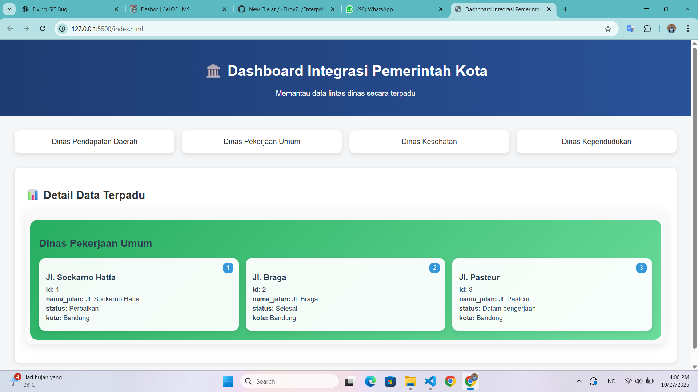

# 🏛️ Enterprise Dashboard Integrasi Pemerintah Kota

Dashboard ini merupakan sistem terpadu yang menampilkan data lintas dinas dalam satu tampilan interaktif dan modern.  
Tujuannya adalah untuk memudahkan pemantauan data antar instansi pemerintahan secara efisien dan terpusat.

---

## 📸 Tampilan Beranda
Berikut adalah tampilan awal aplikasi:

---

## 🚀 Fitur Utama

✅ **Integrasi Multi-Dinas**
- Dinas Pendapatan Daerah (DPD)
- Dinas Pekerjaan Umum (DPU)
- Dinas Kesehatan (Dinkes)
- Dinas Kependudukan (Disduk)

✅ **Tampilan Data Interaktif**
- Klik salah satu dinas untuk menampilkan data detail.
- Data ditampilkan dalam bentuk *modern card view* yang rapi dan responsif.

✅ **Struktur Modular**
- Setiap dinas memiliki file dan data JSON terpisah.
- Arsitektur proyek terorganisir dengan baik dan mudah dikembangkan.

✅ **Tanpa Server Sampingan**
- Dapat dijalankan hanya dengan **Live Server (VS Code)** atau browser lokal (`http://127.0.0.1:5500/`).

---

## 📂 Struktur Folder Proyek

